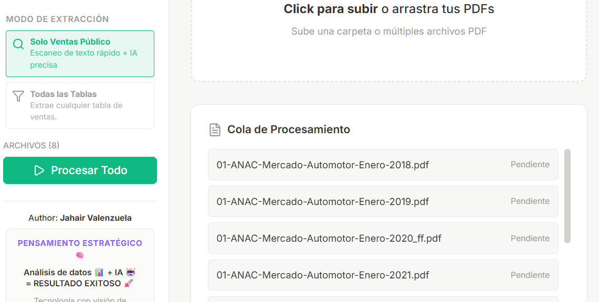
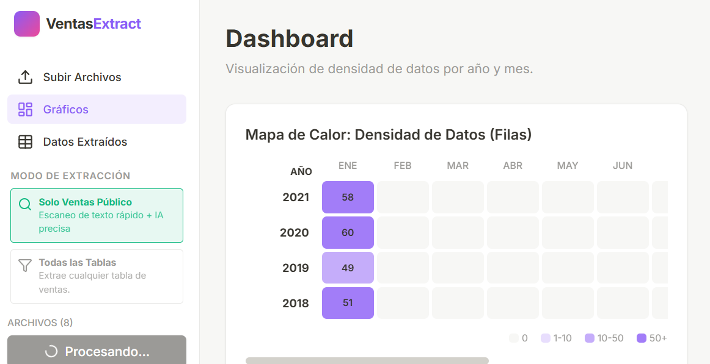
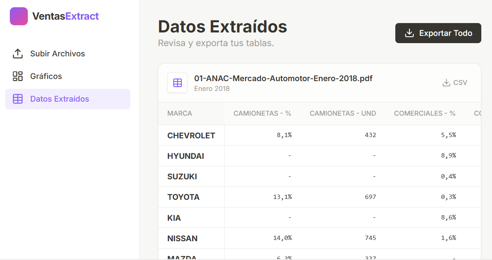

# Ecosistema Automovilístico en Chile 🚗📊  

Repositorio personal con **tres proyectos de datos independientes**, todos alrededor del ecosistema automotor en Chile:

1. **VentasExtract (App web)** → extracción inteligente de tablas de ventas de autos desde PDFs de la **ANAC**.
2. **ETL Accidentes de tránsito (`ETL_API.ipynb`)** → descarga y limpieza de series de accidentes de tránsito en Chile vía API.
3. **ETL Licencias y Permisos (`ETL_licencias_Permisos.ipynb`)** → integración y limpieza de bases del **INE** sobre licencias de conducir y permisos de circulación.

---

## 1) VentasExtract 🚗📄  
_App web para extracción de PDFs de ventas automotrices (ANAC)_

### 1.1. Contexto y objetivo

En Chile, buena parte de la información del **mercado automotor** (ventas, participación por marca, evolución mensual, etc.) se publica en **informes PDF** de la ANAC.  
Estos PDF no vienen listos para análisis: cambian de formato, mezclan tablas, texto y gráficos.

**VentasExtract** resuelve un problema puntual:

> Pasar de **PDFs de la ANAC** a **datasets limpios de ventas** listos para BI, análisis de mercado o modelamiento.

---

### 1.2. Flujo de la app web (3 páginas)

La app tiene tres secciones principales:

#### a) Subir Archivos

Pantalla para cargar los reportes PDF de la ANAC.

- Permite arrastrar y soltar **múltiples archivos o carpetas**.
- Muestra una **cola de procesamiento** con estado:
  - Pendiente → Procesando (con número de página) → Completado / Error.
    

**Modos de extracción:**

1. **Solo ventas al público**  
   - Busca la sección de **“VENTAS A PÚBLICO POR MARCA”** dentro del PDF.
   - Extrae solo las tablas asociadas a esa sección.

2. **Todas las tablas de ventas**  
   - Recorre el documento completo.
   - Extrae todas las tablas que contengan la palabra **“ventas”** en el contexto de la tabla.
   - Útil cuando se quieren analizar otras vistas de ventas además de “ventas a público”.

---

#### b) Gráficos

Sección tipo **dashboard ligero** para visualizar rápidamente lo extraído.

- Gráficos de **densidad de datos por año y por mes**.
- Permite ver en qué períodos hay más información cargada.
- Útil para tener una **vista general del histórico** antes de ir a un BI externo.

---

#### c) Datos Extraídos

Vista tabular de los datos ya procesados:

- Muestra una **previsualización** (primeras filas) del formato final que se exporta.
- Permite revisar columnas, fechas, marcas, etc.
- Incluye botón para **exportar todos los datos a CSV**.

---

### 1.3. VentasExtract Pemite 

- 🕷️ **Scraping automatizado** de PDFs oficiales con **Selenium** (`Extractor_pdf.py`).
- 📄 **Extracción “inteligente” de tablas** combinando:
  - búsqueda de texto en el PDF,
  - análisis visual asistido por IA (Gemini).
- 💻 **Aplicación React** con:
  - carga de PDFs,
  - cola de procesamiento,
  - vista de gráficos y datos,
  - exportación a CSV consolidado.

---

### 1.4. Alcance de los datos (VentasExtract)

- PDFs de **estudios de mercado de la ANAC**, por año y mes.
- Tablas de ventas donde se detectan:
  - Año y mes,
  - Marca,
  - Métricas de ventas / participación (dependen del diseño del PDF).
- Los datos exportados quedan listos para usarse en **Power BI, Tableau, Python, etc.**
- ### 1.5. Instalación y ejecución de VentasExtract (PASO A PASO)
 
 #### Requisitos
 
 - Node.js 18+ (recomendado).
 - npm (o pnpm/yarn, pero en el ejemplo usamos npm).
 
 #### Pasos
 1.Clonar el repositorio
 
 2.Instalar dependencias
  Desde la carpeta donde está package.json:
  npm install
  
 3.Crear el archivo .env.local

 Abre el proyecto en tu editor (por ejemplo, VS Code).
 
 En la raíz del proyecto web (donde está package.json), crea un nuevo archivo llamado:
 
 .env.local
 
 
 La estructura debería verse más o menos así:
 
 /mi-proyecto/
   package.json
   vite.config.ts
   src/
   .env.local   👈
  4.Pegar tu API key de Gemini en .env.local
  Dentro de .env.local, agrega esta línea:

  GEMINI_API_KEY=TU_API_KEY_DE_GEMINI
  
  
  Reemplaza TU_API_KEY_DE_GEMINI por tu clave real de la API de Gemini.

## 2) ETL Accidentes de Tránsito (`ETL_API.ipynb`) 🚑📉  

Notebook independiente enfocado en construir una **serie histórica de accidentes de tránsito en Chile**.

### 2.1. Alcance

- Consumo de la **API oficial** de seguridad vial.
- Rango aproximado: **2018–2024** (configurable).
- **2020 se excluye por defecto** por anomalías fuertes (pandemia), pero se puede activar cambiando un parámetro.

### 2.2. Flujo del notebook

1. Conexión a la API y descarga de datos por año/período.
2. Manejo de paginación / límites de la API (según corresponda).
3. Limpieza:
   - normalización de fechas y horas,
   - homogenización de códigos (tipo de accidente, gravedad, etc.).
4. Unificación:
   - construcción de un **dataset único** listo para análisis temporal, regional y por tipo de siniestro.

---

## 3) ETL Licencias y Permisos (`ETL_licencias_Permisos.ipynb`) 🪪🚘  

Notebook separado que trabaja solo con **bases del INE** sobre licencias de conducir y permisos de circulación.

### 3.1. Alcance y flujo

1. Lectura de múltiples bases (ACCDB/DB u otros formatos) por año/segmento.
2. Integración de:
   - licencias de conducir,
   - permisos de circulación,
   - diccionarios de datos asociados.
3. Homologación de:
   - nombres de columnas,
   - tipos de datos,
   - categorías relevantes (tipo de vehículo, región/comuna, etc.).
4. Limpieza de fechas, variables categóricas, códigos y nulos.
5. Generación de un **dataset limpio** para análisis de parque vehicular, licencias, etc.

---

## 4) Cómo usar cada módulo (resumen rápido)

1. **VentasExtract (App web + PDFs ANAC)**
   - Ejecutar `Extractor_pdf.py` si quieres automatizar la descarga de PDFs.
   - Levantar la app React (ver instrucciones en el subdirectorio correspondiente).
   - Subir PDFs, elegir modo de extracción y exportar CSV desde “Datos Extraídos”.

2. **ETL Accidentes (`ETL_API.ipynb`)**
   - Abrir el notebook.
   - Configurar credenciales/parámetros de la API si corresponde.
   - Ejecutar todas las celdas para generar el dataset histórico (con o sin 2020).

3. **ETL Licencias & Permisos (`ETL_licencias_Permisos.ipynb`)**
   - Descargar las bases del INE.
   - Ajustar rutas locales a los archivos.
   - Ejecutar el notebook para obtener el dataset final.

---

## 5) Fuentes de datos 📂

- **INE – Licencias de conducir y permisos de circulación**  
   https://www.ine.gob.cl/estadisticas/economia/transporte-y-comunicaciones/licencias-de-conducir
   https://www.ine.gob.cl/estadisticas/economia/transporte-y-comunicaciones/permiso-de-circulacion

   Las otras bases de datos utilizadas, la fuente de los mismos, ya se encuentra disponible en los scripts.
---

## 6) Tecnologías principales

- Python (ETL y notebooks)
- Selenium, `webdriver_manager` (scraping y descarga de PDFs ANAC)
- React (frontend de la app VentasExtract)
- IA para análisis visual de PDFs (Gemini)
- Pandas / NumPy para limpieza y transformación de datos
 
